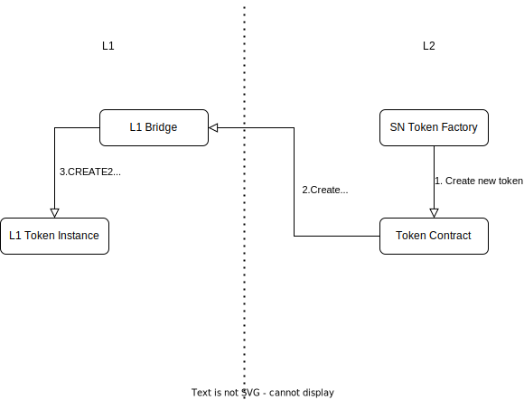

# StarkNet L2->L1 Mint and Bridge standard

The usual flow for minting a new ERC20 or ERC721 token is usually: Mint the token on L1, Mint the token on L2, link them together with the appropriate bridge.

This means that even if there is no immediate need to deploy the token on L1, minting has to be initially done on L1, and only then bridged to L2. This creates unnecessary cost overhead, and requires the deplorer to be knowledgable of development on both environments, and their bridging functionality.

Furthermore, if the governance of the token is handled on L2, it makes little sense to create a complex L1 token to mimic all the functionality.
What is often needed, is the ability to mint the token directly on L2, then have an easy way to port it to L1, and have only the basic functionality available on L1, to enable easy interoperability and settlement.

This repository demonstrates a suggestion to standardize the bridging of assets created and minted on StarkNet L2 to Ethereum L1.

The standard makes heavy use of the ability of StarkNet's L1\<\>L2 [messaging](https://docs.starknet.io/docs/L1%3C%3EL2%20Communication/messaging-mechanism). Thanks to that messaging mechanism, messages can be passed relatively quickly between L1 and L2, and be received by any contract, and with any data.

The standard requires the following components:

- A bridge per standard (e.g. ERC20, ERC721) on L1, that receives a request to create an L1 instance of a token from L2.
- The asset minted on L2 must support the `L2Bridgable` interface, and be aware of the bridge address on L1.

## L1 Bridge operation

The bridge on L1 serves several purposes.

1. It has an endpoint which receives a message from L2, and mints a new token, which is uniquely mapped to the asset on L2 by it's hash.
2. Upon receiving a request to create an L1 instance, a contract is minted with `CREATE2`, and the mapping is stored.
3. Since only basic token functionality is required, the created contract only keeps the storage, and delegates calls to the bridge
4. The bridge handles receiving and withdrawing tokens between L1\<\>L2

## `L1Bridgable` interface (ERC20 example)

The interface has the following functions

`func create_l1_instance( name : felt, symbol : felt )`

Sends the message to the _known_ L2 bridge. The message passes the contract address, the token name, the token symbol.
(In ERC721 it should also pass the URI of the token metadata)

`func bridge_tokens_to_l1( l1_recipient : felt, amount : Uint256)`

Once an instance on L1 is created, tokens can be bridged directly from the contract to L1. Upon bridging, the contract creator can decide to either lock or burn them.
(Possible improvement is to register the token pair in a separate contract)

`func bridge_tokens_from_l1( from_address : felt, l2_recipient : felt, amount : Uint256)`

The bridge on L1 handles sending tokens back to L2. Upon receiving the message, the tokens should be minted/unlocked to the requested address

## Flow diagram



The diagram shows the steps of creating a token on L1

## Example contracts

| Contract                 | Link                                                                                                                                      |
| ------------------------ | ----------------------------------------------------------------------------------------------------------------------------------------- |
| L2 ERC20 Contract Class  | [L2 ERC20 Contract Class](https://beta-goerli.voyager.online/contract/0x061d12d85dd50f9fdba87cdb0a2170ece3d7b3e6eabaaeaf2f88b1dae44c94dc) |
| L2 ERC20 Contract        | [L2 ERC20 Contract](https://beta-goerli.voyager.online/contract/0x050d5605ab9cfcc126de145635776c6a144445d61f738cc99826f92e02b4dc0f)       |
| L1 ERC20 Goerli Bridge   | [L1 ERC20 Goerli Bridge](https://goerli.etherscan.io/address/0xb5029935a185a8fec57b178543481f48cb6665c6)                                  |
| L1 ERC20 Goerli Instance | [L1 ERC20 Goerli Instance](https://goerli.etherscan.io/address/0xA3253C36C66c51CC7182D0D5dD8d12f8AAC5dE7a)                                |

## Building

### Pre Requisites

Before running any command, make sure to install dependencies:

```sh
$ yarn install # Installing hardhat
$ pip install -r requirements.txt # For OpenZeppelin contract
```

### Compile

Compile the smart contracts with Hardhat:

```sh
$ yarn compile
```

### Test

Run the Mocha tests:

```sh
$ yarn test
```

### Deployment

See the env variables in `./env.example` for variables requires for deployment of the contracts

## Disclaimer

These contracts are only given as an example. They HAVE NOT undergone any audit. They SHOULD NOT be used for any production level application.

If you like it than you shoulda put a start ⭐ on it

Twitter: [@amanusk\_][https://twitter.com/amanusk_]

## License

MIT
